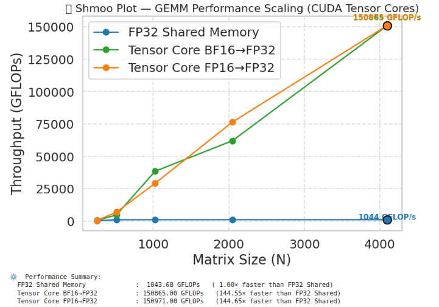

# 🚀 CUDA GEMM Benchmark Suite

This repository provides a **comprehensive CUDA GEMM (Matrix Multiplication) microbenchmark**, comparing multiple precision and optimization variants on RTX3060 GPU (12GB):

- A **baseline FP32 shared-memory implementation**,  
- A **Tensor Core accelerated FP16 → FP32 mixed-precision kernel**, and  
- An optional **BF16 → FP32 Tensor Core kernel** (for Ampere or newer GPUs).

It demonstrates how **shared-memory tiling**, **Tensor Core usage**, and **precision formats** affect performance and accuracy across different matrix sizes.

---

## 🧩 Overview

| Variant ID | Kernel Type               | Precision       | Strategy                  | Description |
|-------------|--------------------------|------------------|---------------------------|--------------|
| **0** | Shared-Memory GEMM | FP32 | Global Memory + Shared Tile | Baseline tiled GEMM in shared memory |
| **1** | Tensor Core GEMM | FP16 → FP32 | WMMA API | Tensor Core mixed-precision GEMM |
| **2** | Tensor Core GEMM | BF16 → FP32 | WMMA API (Ampere+) | BFloat16 input variant for higher numeric range |

Each kernel computes `C = A × B` for square matrices `MxK` and `KxN`, measures runtime, GFLOPs, and accuracy vs a CPU reference.

---
---
## ⚙️ Build Instructions

Ensure **CUDA Toolkit ≥ 12.0** and a **GPU with Tensor Core support**.

```bash
# For Ampere (RTX 30, A100, etc.)
nvcc -O3 --gpu-architecture=sm_80 --use_fast_math matmul_variants.cu -o matmul_variants
```
---

## 🧠 Performance Summary (RTX 3060, CUDA 12.4)

| Variant | Matrix Size | Time (ms) | GFLOPs | Speedup vs FP32 | Max Abs Error |
|----------|-------------|-----------:|--------:|----------------:|---------------:|
| FP32 Shared Memory | 512 | 0.272 | 988.4 | 1.00× | 4.6e-05 |
| Tensor Core FP16→FP32 | 512 | 0.039 | 6864.7 | **6.95×** | 145.84 |
| Tensor Core BF16→FP32 | 512 | 0.056 | 4760.8 | **4.82×** | 145.84 |

🧩 **Observation:**  
Tensor Cores provide up to a **~7× throughput improvement** over FP32 shared-memory GEMM.  
FP16 achieves the highest performance, while BF16 offers better numeric range and stability with slightly reduced throughput.

---
## 🚀 Running the Benchmark
```bash
./matmul_variants 
Or specify custom matrix size:
./matmul_variants 1024 1024 1024
```
---
### 🖼️ Shmoo Runtime Comparison


